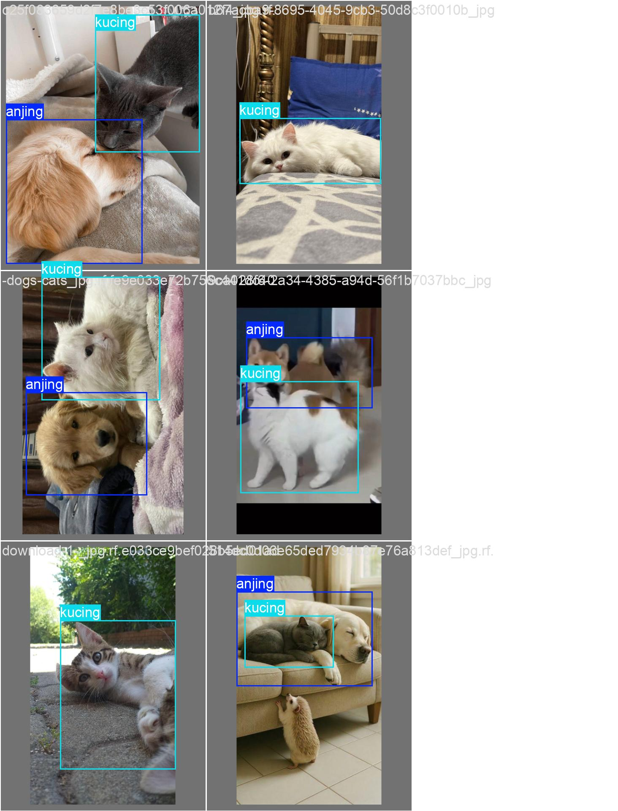
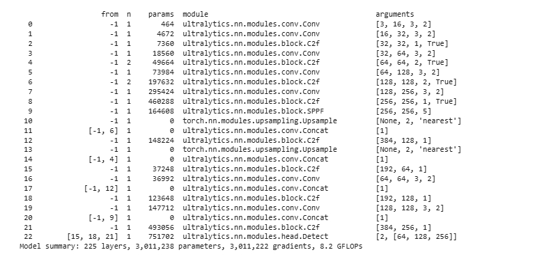
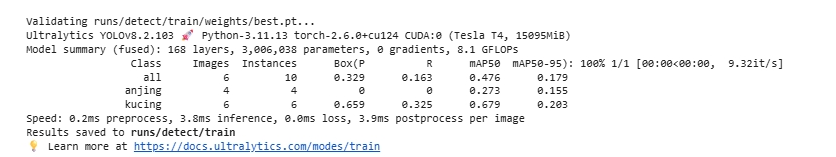
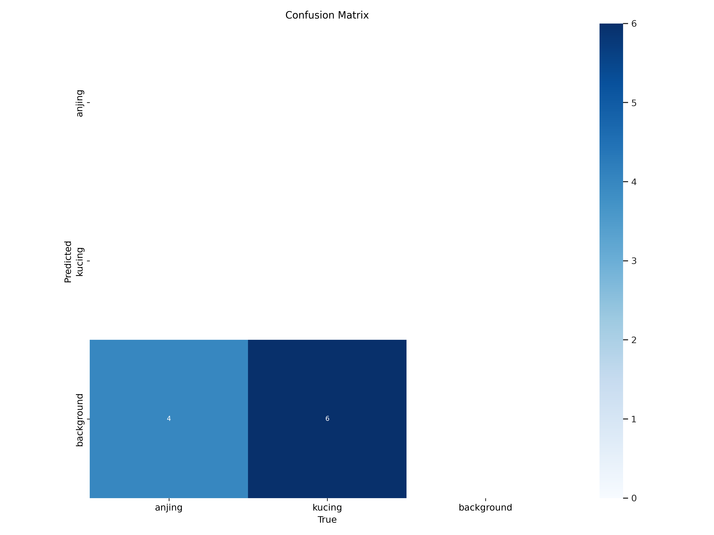
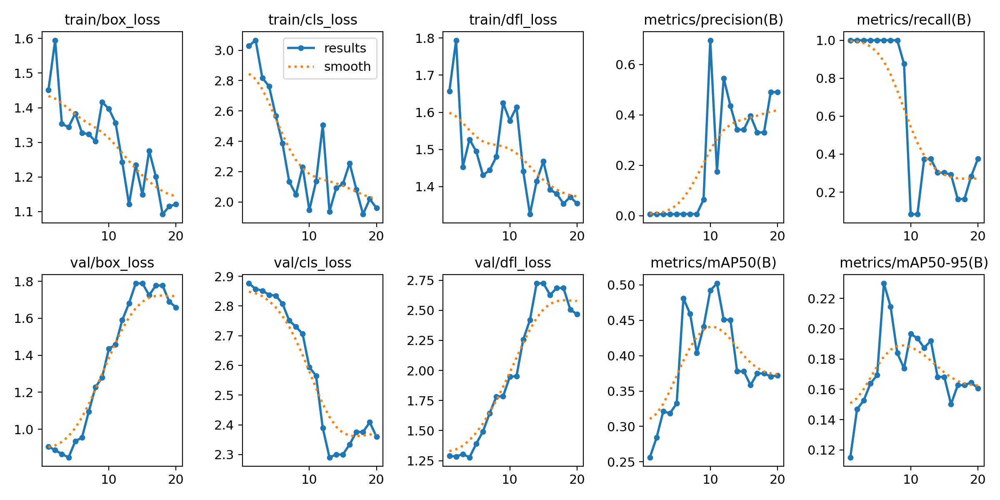

🌱 YOLOv8 Object Detection - Data Labeling Portfolio🌱

Ini adalah proyek portofolio data labeling dan pelatihan model YOLOv8 yang saya kerjakan menggunakan dataset custom untuk mendeteksi objek **KUCING** dan **ANJING**.

Proyek ini mencakup proses:
- Data labeling (annotasi bounding box)
- Setup konfigurasi YOLOv8
- Training dan validasi model
- Inference untuk menguji model

---

📁 Struktur Folder 

yolov8-labeling-project/

├── [📄 Lihat file data.yaml](data/data.yaml)

├── 📂 [Buka folder `train`](./train/) # Data training

├── 📂 [Buka folder `valid`](./valid/) # Data validasi

├── 📂 [Buka folder `test`](./test/) # Data pengujian

├── README.md # Dokumentasi proyek

├── [📄 Lihat file best(2).pt](./data/best.pt) # Model hasil training

├── [📄 Lihat file results.md](./data/results.md)  # Catatan hasil training/inference

---

## 📦 Dataset

Dataset dibuat dan dilabeli secara manual menggunakan Roboflow, lalu diekspor dalam format YOLOv8. Label terdiri dari beberapa kelas objek relevan dengan kasus nyata.

- Jumlah gambar train: **21**
- Jumlah gambar valid: **6**
- Jumlah kelas: **(otomatis terdeteksi dari `data.yaml`)**

---

> ⚠️ Gambar & label hanya digunakan untuk keperluan edukasi dan demonstrasi portofolio.

---

## ⚙️ Model Training

Model dilatih menggunakan YOLOv8 dari library `ultralytics`.

- Training dilakukan di Google Colab 
- Hasil disimpan di: `yolov8-training/best.pt`

---

## 🔍 Inference & Evaluasi

Downloading https://github.com/ultralytics/assets/releases/download/v8.2.0/yolov8n.pt to 'yolov8n.pt'...
100% 6.25M/6.25M [00:00<00:00, 119MB/s]
New https://pypi.org/project/ultralytics/8.3.155 available 😃 Update with 'pip install -U ultralytics'
Ultralytics YOLOv8.2.103 🚀 Python-3.11.13 torch-2.6.0+cu124 CUDA:0 (Tesla T4, 15095MiB)
engine/trainer: task=detect, mode=train, model=yolov8n.pt, data=/content/kucing-anjing-1/data.yaml, epochs=20, time=None, patience=100, batch=8, imgsz=640, save=True, save_period=-1, cache=False, device=None, workers=8, project=None, name=train, exist_ok=False, pretrained=True, optimizer=auto, verbose=True, seed=0, deterministic=True, single_cls=False, rect=False, cos_lr=False, close_mosaic=10, resume=False, amp=True, fraction=1.0, profile=False, freeze=None, multi_scale=False, overlap_mask=True, mask_ratio=4, dropout=0.0, val=True, split=val, save_json=False, save_hybrid=False, conf=None, iou=0.7, max_det=300, half=False, dnn=False, plots=True, source=None, vid_stride=1, stream_buffer=False, visualize=False, augment=False, agnostic_nms=False, classes=None, retina_masks=False, embed=None, show=False, save_frames=False, save_txt=False, save_conf=False, save_crop=False, show_labels=True, show_conf=True, show_boxes=True, line_width=None, format=torchscript, keras=False, optimize=False, int8=False, dynamic=False, simplify=True, opset=None, workspace=4, nms=False, lr0=0.01, lrf=0.01, momentum=0.937, weight_decay=0.0005, warmup_epochs=3.0, warmup_momentum=0.8, warmup_bias_lr=0.1, box=7.5, cls=0.5, dfl=1.5, pose=12.0, kobj=1.0, label_smoothing=0.0, nbs=64, hsv_h=0.015, hsv_s=0.7, hsv_v=0.4, degrees=0.0, translate=0.1, scale=0.5, shear=0.0, perspective=0.0, flipud=0.0, fliplr=0.5, bgr=0.0, mosaic=1.0, mixup=0.0, copy_paste=0.0, auto_augment=randaugment, erasing=0.4, crop_fraction=1.0, cfg=None, tracker=botsort.yaml, save_dir=runs/detect/train
Downloading https://ultralytics.com/assets/Arial.ttf to '/root/.config/Ultralytics/Arial.ttf'...
100% 755k/755k [00:00<00:00, 21.2MB/s]
WARNING: All log messages before absl::InitializeLog() is called are written to STDERR
E0000 00:00:1750080758.466679   18344 cuda_dnn.cc:8310] Unable to register cuDNN factory: Attempting to register factory for plugin cuDNN when one has already been registered
E0000 00:00:1750080758.533002   18344 cuda_blas.cc:1418] Unable to register cuBLAS factory: Attempting to register factory for plugin cuBLAS when one has already been registered
Overriding model.yaml nc=80 with nc=2

Transferred 319/355 items from pretrained weights
TensorBoard: Start with 'tensorboard --logdir runs/detect/train', view at http://localhost:6006/
Freezing layer 'model.22.dfl.conv.weight'
AMP: running Automatic Mixed Precision (AMP) checks with YOLOv8n...
AMP: checks passed ✅
train: Scanning /content/kucing-anjing-1/train/labels... 21 images, 0 backgrounds, 0 corrupt: 100% 21/21 [00:00<00:00, 1837.50it/s]
train: New cache created: /content/kucing-anjing-1/train/labels.cache
/usr/local/lib/python3.11/dist-packages/ultralytics/data/augment.py:1837: UserWarning: Argument(s) 'quality_lower' are not valid for transform ImageCompression
  A.ImageCompression(quality_lower=75, p=0.0),
albumentations: Blur(p=0.01, blur_limit=(3, 7)), MedianBlur(p=0.01, blur_limit=(3, 7)), ToGray(p=0.01, method='weighted_average', num_output_channels=3), CLAHE(p=0.01, clip_limit=(1.0, 4.0), tile_grid_size=(8, 8))
val: Scanning /content/kucing-anjing-1/valid/labels... 6 images, 0 backgrounds, 0 corrupt: 100% 6/6 [00:00<00:00, 1146.77it/s]
val: New cache created: /content/kucing-anjing-1/valid/labels.cache
Plotting labels to runs/detect/train/labels.jpg... 
optimizer: 'optimizer=auto' found, ignoring 'lr0=0.01' and 'momentum=0.937' and determining best 'optimizer', 'lr0' and 'momentum' automatically... 
optimizer: AdamW(lr=0.001667, momentum=0.9) with parameter groups 57 weight(decay=0.0), 64 weight(decay=0.0005), 63 bias(decay=0.0)
TensorBoard: model graph visualization added ✅
Image sizes 640 train, 640 val
Using 2 dataloader workers
Logging results to runs/detect/train
Starting training for 20 epochs...

      Epoch    GPU_mem   box_loss   cls_loss   dfl_loss  Instances       Size
       1/20       1.2G      1.463      3.024      1.662         20        640: 100% 3/3 [00:01<00:00,  1.71it/s]
                 Class     Images  Instances      Box(P          R      mAP50  mAP50-95): 100% 1/1 [00:01<00:00,  1.16s/it]
                   all          6         10    0.00581          1      0.253      0.114

      Epoch    GPU_mem   box_loss   cls_loss   dfl_loss  Instances       Size
       2/20      1.17G      1.617      3.057      1.825         17        640: 100% 3/3 [00:00<00:00,  5.71it/s]
                 Class     Images  Instances      Box(P          R      mAP50  mAP50-95): 100% 1/1 [00:00<00:00, 11.71it/s]
                   all          6         10    0.00561          1      0.293      0.141

      Epoch    GPU_mem   box_loss   cls_loss   dfl_loss  Instances       Size
       3/20      1.22G      1.372      2.783      1.443         25        640: 100% 3/3 [00:00<00:00,  7.76it/s]
                 Class     Images  Instances      Box(P          R      mAP50  mAP50-95): 100% 1/1 [00:00<00:00, 10.06it/s]
                   all          6         10    0.00552          1      0.292      0.153

      Epoch    GPU_mem   box_loss   cls_loss   dfl_loss  Instances       Size
       4/20      1.19G      1.337      2.748      1.508         19        640: 100% 3/3 [00:00<00:00,  5.39it/s]
                 Class     Images  Instances      Box(P          R      mAP50  mAP50-95): 100% 1/1 [00:00<00:00,  6.57it/s]
                   all          6         10    0.00567          1      0.268      0.149

      Epoch    GPU_mem   box_loss   cls_loss   dfl_loss  Instances       Size
       5/20      1.22G      1.407      2.517      1.508         20        640: 100% 3/3 [00:00<00:00,  5.06it/s]
                 Class     Images  Instances      Box(P          R      mAP50  mAP50-95): 100% 1/1 [00:00<00:00,  9.51it/s]
                   all          6         10    0.00591          1      0.278       0.16

      Epoch    GPU_mem   box_loss   cls_loss   dfl_loss  Instances       Size
       6/20      1.19G      1.334      2.452      1.439         21        640: 100% 3/3 [00:00<00:00,  7.75it/s]
                 Class     Images  Instances      Box(P          R      mAP50  mAP50-95): 100% 1/1 [00:00<00:00, 10.89it/s]
                   all          6         10    0.00609          1      0.382      0.161

      Epoch    GPU_mem   box_loss   cls_loss   dfl_loss  Instances       Size
       7/20      1.22G      1.377      2.264      1.494         25        640: 100% 3/3 [00:00<00:00,  7.60it/s]
                 Class     Images  Instances      Box(P          R      mAP50  mAP50-95): 100% 1/1 [00:00<00:00,  8.99it/s]
                   all          6         10    0.00619          1      0.293      0.141

      Epoch    GPU_mem   box_loss   cls_loss   dfl_loss  Instances       Size
       8/20      1.19G      1.388      2.115      1.484         15        640: 100% 3/3 [00:00<00:00,  8.13it/s]
                 Class     Images  Instances      Box(P          R      mAP50  mAP50-95): 100% 1/1 [00:00<00:00, 15.09it/s]
                   all          6         10    0.00625          1      0.251      0.131

      Epoch    GPU_mem   box_loss   cls_loss   dfl_loss  Instances       Size
       9/20      1.23G      1.451      2.278      1.613         23        640: 100% 3/3 [00:00<00:00,  8.64it/s]
                 Class     Images  Instances      Box(P          R      mAP50  mAP50-95): 100% 1/1 [00:00<00:00, 14.75it/s]
                   all          6         10    0.00631          1       0.25      0.113

      Epoch    GPU_mem   box_loss   cls_loss   dfl_loss  Instances       Size
      10/20      1.25G      1.427      1.983      1.544         32        640: 100% 3/3 [00:00<00:00,  8.38it/s]
                 Class     Images  Instances      Box(P          R      mAP50  mAP50-95): 100% 1/1 [00:00<00:00, 14.95it/s]
                   all          6         10      0.157      0.708      0.307      0.103
Closing dataloader mosaic
/usr/local/lib/python3.11/dist-packages/ultralytics/data/augment.py:1837: UserWarning: Argument(s) 'quality_lower' are not valid for transform ImageCompression
  A.ImageCompression(quality_lower=75, p=0.0),
albumentations: Blur(p=0.01, blur_limit=(3, 7)), MedianBlur(p=0.01, blur_limit=(3, 7)), ToGray(p=0.01, method='weighted_average', num_output_channels=3), CLAHE(p=0.01, clip_limit=(1.0, 4.0), tile_grid_size=(8, 8))

      Epoch    GPU_mem   box_loss   cls_loss   dfl_loss  Instances       Size
      11/20      1.23G      1.307      2.288      1.554         11        640: 100% 3/3 [00:00<00:00,  3.21it/s]
                 Class     Images  Instances      Box(P          R      mAP50  mAP50-95): 100% 1/1 [00:00<00:00,  5.58it/s]
                   all          6         10      0.302       0.25      0.314      0.104

      Epoch    GPU_mem   box_loss   cls_loss   dfl_loss  Instances       Size
      12/20      1.23G      1.436      2.547      1.456          9        640: 100% 3/3 [00:00<00:00,  3.95it/s]
                 Class     Images  Instances      Box(P          R      mAP50  mAP50-95): 100% 1/1 [00:00<00:00,  5.06it/s]
                   all          6         10      0.829      0.162      0.281      0.101

      Epoch    GPU_mem   box_loss   cls_loss   dfl_loss  Instances       Size
      13/20      1.22G      1.247      2.013       1.37         11        640: 100% 3/3 [00:00<00:00,  7.48it/s]
                 Class     Images  Instances      Box(P          R      mAP50  mAP50-95): 100% 1/1 [00:00<00:00, 10.64it/s]
                   all          6         10      0.347      0.194      0.313      0.107

      Epoch    GPU_mem   box_loss   cls_loss   dfl_loss  Instances       Size
      14/20      1.19G       1.31      2.109      1.478          9        640: 100% 3/3 [00:00<00:00,  7.85it/s]
                 Class     Images  Instances      Box(P          R      mAP50  mAP50-95): 100% 1/1 [00:00<00:00, 12.62it/s]
                   all          6         10      0.356      0.211      0.351      0.132

      Epoch    GPU_mem   box_loss   cls_loss   dfl_loss  Instances       Size
      15/20      1.23G      1.108      2.063      1.455          9        640: 100% 3/3 [00:00<00:00,  9.00it/s]
                 Class     Images  Instances      Box(P          R      mAP50  mAP50-95): 100% 1/1 [00:00<00:00, 10.86it/s]
                   all          6         10      0.356      0.211      0.351      0.132

      Epoch    GPU_mem   box_loss   cls_loss   dfl_loss  Instances       Size
      16/20      1.23G       1.21      2.198      1.337         10        640: 100% 3/3 [00:00<00:00,  8.68it/s]
                 Class     Images  Instances      Box(P          R      mAP50  mAP50-95): 100% 1/1 [00:00<00:00,  9.53it/s]
                   all          6         10      0.329      0.162      0.477      0.179

      Epoch    GPU_mem   box_loss   cls_loss   dfl_loss  Instances       Size
      17/20      1.22G      1.267      2.035      1.396          9        640: 100% 3/3 [00:00<00:00,  8.90it/s]
                 Class     Images  Instances      Box(P          R      mAP50  mAP50-95): 100% 1/1 [00:00<00:00, 11.16it/s]
                   all          6         10       0.37      0.241      0.428      0.163

      Epoch    GPU_mem   box_loss   cls_loss   dfl_loss  Instances       Size
      18/20      1.18G       1.11      1.906      1.379         13        640: 100% 3/3 [00:00<00:00,  7.93it/s]
                 Class     Images  Instances      Box(P          R      mAP50  mAP50-95): 100% 1/1 [00:00<00:00, 13.90it/s]
                   all          6         10       0.37      0.241      0.428      0.163

      Epoch    GPU_mem   box_loss   cls_loss   dfl_loss  Instances       Size
      19/20      1.18G      1.075      1.972      1.359         17        640: 100% 3/3 [00:00<00:00,  8.59it/s]
                 Class     Images  Instances      Box(P          R      mAP50  mAP50-95): 100% 1/1 [00:00<00:00, 15.59it/s]
                   all          6         10      0.361      0.296      0.328      0.166

      Epoch    GPU_mem   box_loss   cls_loss   dfl_loss  Instances       Size
      20/20      1.23G      1.138      1.913      1.389         15        640: 100% 3/3 [00:00<00:00,  8.38it/s]
                 Class     Images  Instances      Box(P          R      mAP50  mAP50-95): 100% 1/1 [00:00<00:00, 13.92it/s]
                   all          6         10      0.346       0.35      0.336      0.173

20 epochs completed in 0.010 hours.
Optimizer stripped from runs/detect/train/weights/last.pt, 6.2MB
Optimizer stripped from runs/detect/train/weights/best.pt, 6.2MB

--

## 🔍 Analisis

-Presisi (P) rendah (0.329): Banyak false positive (objek salah terdeteksi).

-Recall (R) sangat rendah (0.163): Model melewatkan 83.7% objek (false negative tinggi).

-Kelas "anjing" gagal total: Tidak ada deteksi yang benar (P=R=0).

-Kelas "kucing" lebih baik: Tapi masih di bawah standar (mAP50=0.679).

## Confusion matrix

## Results

## 📬 Contact

Jika Anda ingin berdiskusi tentang proyek ini atau kolaborasi, silakan hubungi saya melalui GitHub atau LinkedIn.
